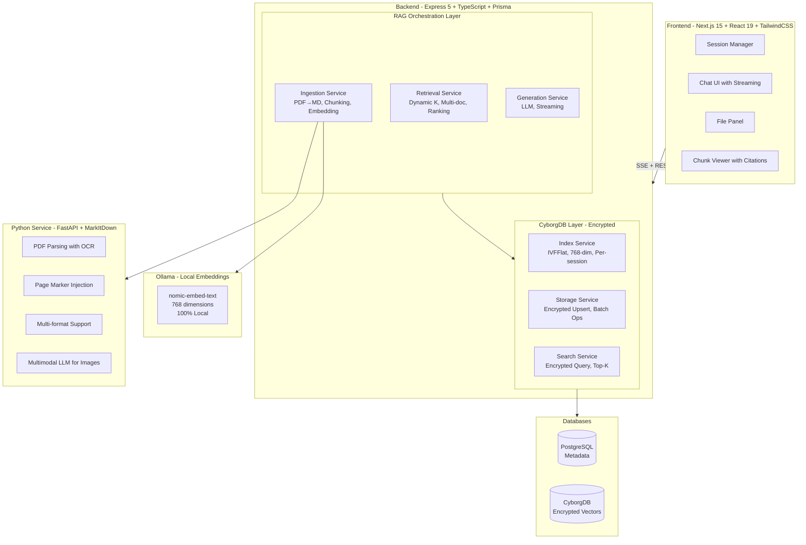
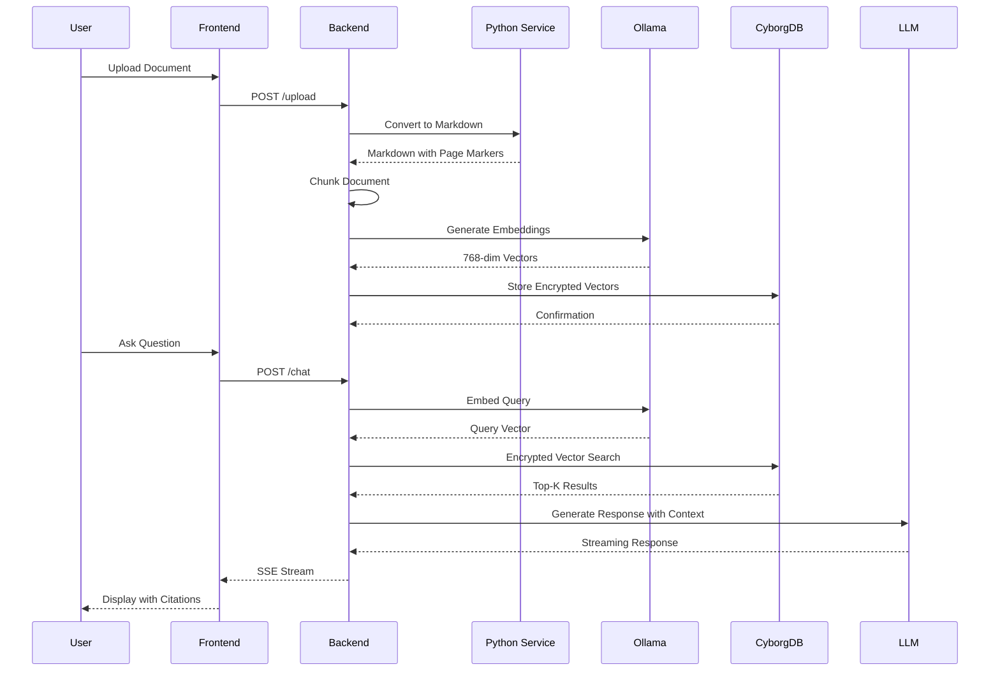

  
  # VEIL - Encrypted Document Intelligence
  
  **Search millions of sensitive documents without exposing your sources.**
  
  
  
  
  
  [Live Demo](https://cyborg.arpantaneja.dev/) • [Features](#features) • [Architecture](#technical-architecture) • [Quick Start](#quick-start)

---

## Screenshots

  

### Document Upload & Processing

### Chunk Viewer with Citations

---

## The Problem: Investigative Journalism Needs Secure Document Analysis

Investigative journalists often work with **highly sensitive leaked documents** like court filings, financial records, whistleblower evidence, and classified materials. Traditional document analysis tools store your data in plaintext, creating massive security risks:

- **Source Exposure**: Unencrypted databases can be subpoenaed or hacked
- **Legal Liability**: Storing sensitive documents in the clear creates liability  
- **Chilling Effect**: Journalists self-censor knowing their data isn't protected

**VEIL solves this with end-to-end encrypted vector search powered by CyborgDB.**

---

## Why Encryption Matters for Journalism

<table>
<tr>
<td width="50%">

### Traditional RAG Systems

Documents are converted to plaintext chunks and stored in a vector database. Anyone with database access can read your sources.

</td>
<td width="50%">

### VEIL with CyborgDB

Documents are converted to encrypted chunks and stored as encrypted vectors. Even with database access, data is unreadable without keys.

</td>
</tr>
</table>

### CyborgDB's Encryption Guarantees

| Security Feature | Description |
|------------------|-------------|
| **Client-side Encryption** | Vectors are encrypted BEFORE leaving your machine |
| **Zero-Knowledge Architecture** | CyborgDB cannot read your data ever |
| **AES-256 Encryption** | Military-grade encryption for vector indices |
| **Per-Session Keys** | Each investigation session uses unique encryption keys |
| **Encrypted Search** | Search queries are performed on encrypted data |

> *"With VEIL, journalists can analyze thousands of leaked documents with the same security guarantees as Signal messaging."*

---

## Features

### Multi-Format Document Support
- **PDFs** with page-level citations (OCR-enabled)
- **Word Documents** (.docx)
- **Spreadsheets** (.xlsx, .csv)
- **Presentations** (.pptx)
- **Images** with vision AI extraction
- **Plain text** files

### Intelligent RAG Pipeline
- **Semantic chunking** with overlap for context preservation
- **Dynamic TopK** calculation based on document count
- **Multi-document parallel search** across entire case files
- **Page-level citation tracking** for PDF documents
- **Ranked context retrieval** with relevance scoring

### Real-Time Chat Interface
- **Streaming responses** from llm
- **Session-based conversations** with full history
- **Inline citations** linking directly to source pages
- **Chunk viewer** for examining exact source text

### Processing Transparency
- **Live engine events** showing every processing step
- **Upload progress tracking** for large documents
- **Vector storage confirmations** with index names
- **Search result previews** with chunk counts

---

## Technical Architecture

### Data Flow

---

## RAG Techniques Used

### 1. Semantic Chunking with Overlap

Documents are split into 2000-character chunks with 200-character overlap to preserve context across boundaries. The chunking algorithm uses priority-based separators (paragraphs, lines, sentences, words) to find natural break points.

### 2. Dynamic TopK Retrieval

The system automatically adjusts the number of chunks retrieved based on the document count to optimize context quality within token limits.

| Documents | TopK Per Doc | Total Context |
|-----------|--------------|---------------|
| 1         | 15           | ~7,500 tokens |
| 5         | 10           | ~25,000 tokens|
| 10+       | 8            | ~40,000 tokens|

### 3. Parallel Multi-Document Search

When querying across multiple documents, VEIL performs concurrent vector searches against each document's chunks, then ranks and merges results by relevance score.

### 4. Page-Level Citation Tracking

PDF page markers are extracted during parsing and preserved through the chunking process. The LLM injects citations in the format `[SOURCE: document.pdf | Page 12]` which link directly to the source in the chunk viewer.

### 5. Normalized Vector Embeddings

All embeddings are L2-normalized before storage to ensure consistent cosine similarity scoring during retrieval.

---

## Performance & Scale

| Metric | Value |
|--------|-------|
| **Token Budget** | 150,000 tokens per query |
| **Max Chunks per Query** | 50 chunks |
| **Max Chunks per Document** | 15 chunks |
| **Embedding Dimension** | 768 (nomic-embed-text) |
| **Embedding Batch Size** | 5 concurrent |
| **Vector Upsert Batch** | 50 vectors per operation |
| **Streaming Latency** | <100ms first token |

### Document Processing Benchmarks

| Document Type | Size | Processing Time |
|---------------|------|-----------------|
| PDF (10 pages) | ~500KB | ~3s |
| PDF (100 pages) | ~5MB | ~15s |
| Large legal filing | ~50MB | ~60s |
| DOCX with images | ~10MB | ~8s |

---

## Run Entirely Locally

VEIL is designed to run **completely air-gapped** for maximum security. All services run in Docker:

- **CyborgDB**: Encrypted vector storage (local)
- **Ollama**: nomic-embed-text embeddings (local)
- **PostgreSQL**: Metadata storage (local)
- **Python service**: Document parsing (local)
- **Backend**: Express API (local)
- **Frontend**: Next.js UI (local)

### Why Local Matters for Journalists

| Concern | Cloud Solution | VEIL Local |
|---------|---------------|------------|
| **Subpoena Risk** | High - Provider logs everything | None - No external records |
| **Network Sniffing** | Encrypted but metadata exposed | No network traffic |
| **Third-Party Access** | Provider ToS allows access | You control the keys |
| **Data Residency** | Unknown jurisdiction | Your machine only |

---

## Quick Start

### Prerequisites
- Docker & Docker Compose
- Node.js 20+ (for development)

### 1. Clone & Configure

Clone the repository and create your environment file with the required configuration:
- `ENCRYPTION_KEY`: A base64-encoded 32-byte key for CyborgDB encryption
- `DATABASE_URL`: PostgreSQL connection string

### 2. Generate Encryption Key

Generate a secure 32-byte encryption key using Node.js crypto module and encode it as base64.

### 3. Launch

Start all services with Docker Compose and access the application at http://localhost:3000.

### 4. Development Mode

For local development, run the backend, frontend, and Python service separately with their respective dev commands.

---

## Tech Stack

| Layer | Technology |
|-------|------------|
| **Frontend** | Next.js 15, React 19, TailwindCSS, Radix UI |
| **Backend** | Express 5, TypeScript, Prisma ORM |
| **Vector DB** | CyborgDB (encrypted) |
| **Embeddings** | Ollama + nomic-embed-text (768-dim) |
| **LLM** | Ollama - Llama 4 Maverick |
| **Document Parsing** | FastAPI + MarkItDown + PyMuPDF |
| **Database** | PostgreSQL 16 |
| **Auth** | JWT + Google OAuth |

---
## Team

Built by:
- **Arpan Taneja**
- **Ashish K. Chowdhary**  
- **Pratham Gupta**
- **Himanshu Gupta**
- **Aditya**

---

## License

MIT License - See [LICENSE](LICENSE) for details.

---

  
  **[Try VEIL Live](https://cyborg.arpantaneja.dev/)**
  
  *Protecting sources. Exposing truth.*
  

