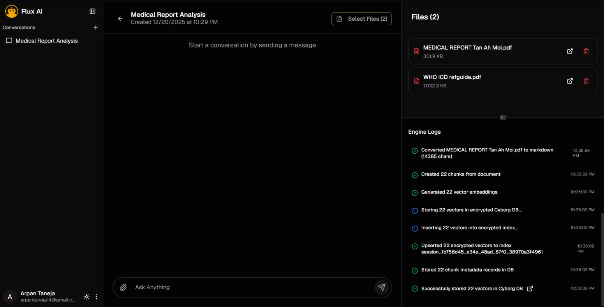
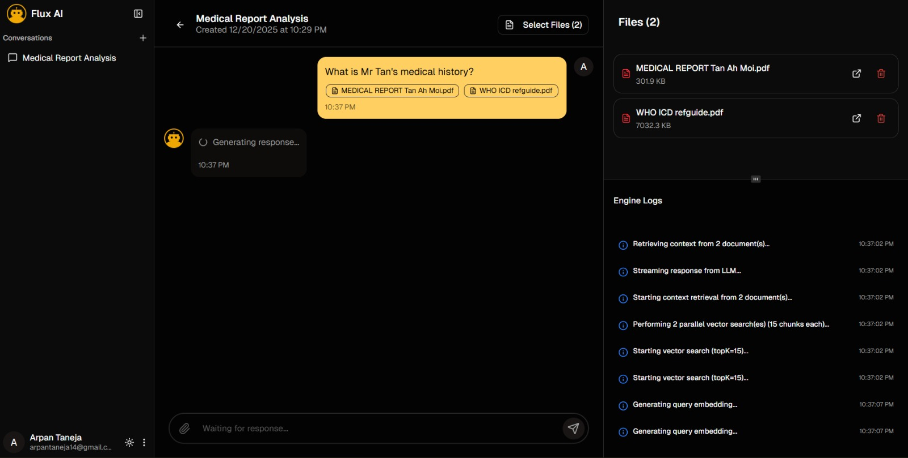
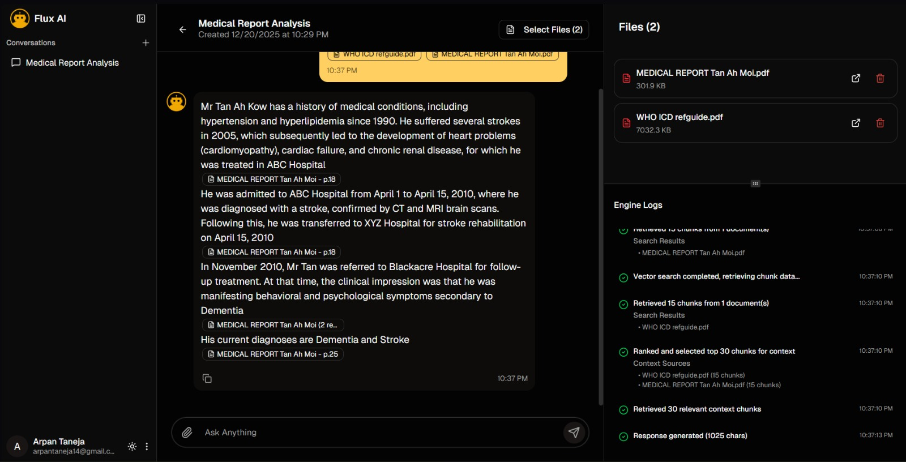
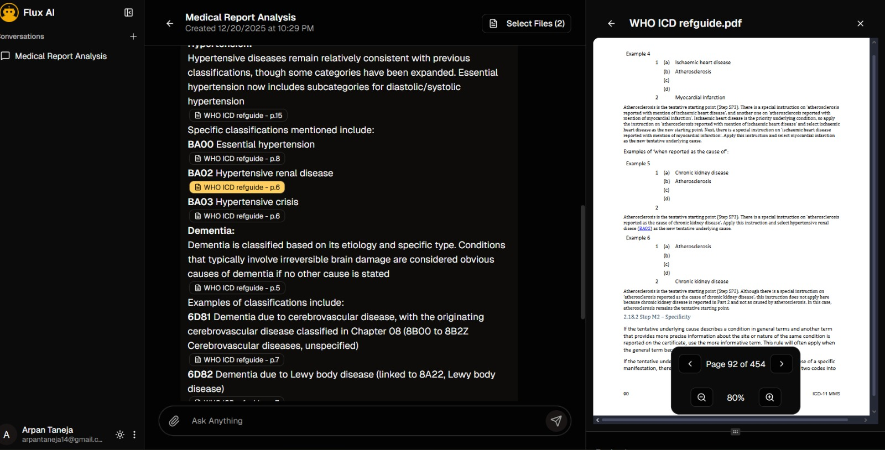
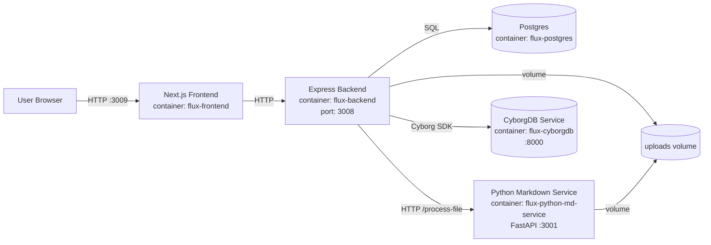
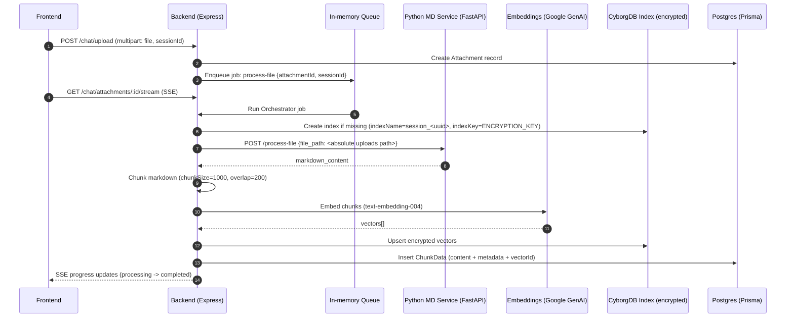
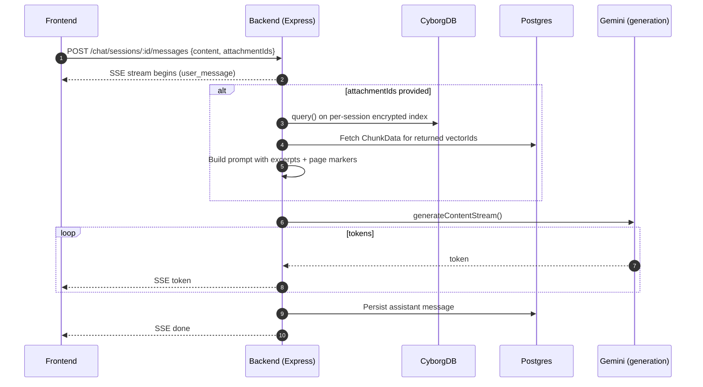
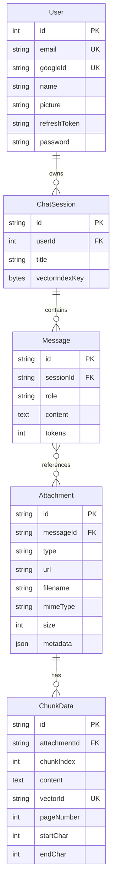

# Flux AI (Cyborg-DB)

Flux AI is a full-stack document Q&A app built for the **CyborgDB Hackathon**. It performs Retrieval-Augmented Generation (RAG) over user-uploaded files and stores embeddings in **encrypted CyborgDB indexes** for secure similarity search.

### Index

- [Screenshots](#screenshots)
- [CyborgDB Highlights](#cyborgdb-highlights)
- [Tech Stack](#tech-stack)
- [Key Features](#key-features)
- [Architecture](#architecture)
- [Quickstart (Docker)](#quickstart-docker)
- [Configuration](#configuration)
- [Migrations + Seed](#migrations--seed)
- [Local Development (No Docker)](#local-development-no-docker)
- [Troubleshooting](#troubleshooting)

## Screenshots






## CyborgDB Highlights

This project is designed to highlight CyborgDB capabilities in a practical RAG system:

- **Encrypted vector storage**: embeddings live inside CyborgDB, not in plaintext tables.
- **Per-session isolation**: each chat session gets its own encrypted index (`session_<sessionId>`), reducing blast radius and simplifying access control.
- **Secure retrieval**: similarity search runs against encrypted vectors using an `ENCRYPTION_KEY`-backed index key.

## Tech Stack

- **Frontend**: Next.js (App Router), TypeScript, Tailwind CSS
- **Backend**: Node.js, Express, TypeScript
- **RAG / LLM**: Google GenAI (embeddings + generation)
- **Vector store**: CyborgDB (encrypted indexes)
- **Database**: Postgres + Prisma
- **Ingestion**: Python FastAPI service (file/URL → Markdown)
- **Streaming**: Server-Sent Events (SSE)

## Key Features

- **End-to-end RAG ingestion**: upload → convert to Markdown → chunk → embed → encrypted upsert → chunk metadata persisted.
- **Attachment-scoped retrieval**: users select which files to use; only those documents are searched.
- **Streaming chat (SSE)**: token streaming to the UI, plus a separate stream of “engine events” for logs/progress.
- **Multi-format ingestion**: PDFs, Office docs (DOCX/PPTX/XLSX), images, and common text formats (based on backend allow-list).
- **Chunk viewer + citations**: responses can reference chunks; UI can open the source document.
- **Auth**: JWT auth, with optional Google OAuth and a **guest login** path.

## Architecture

### Container Topology



### File Ingestion Flow (Indexing)



### Chat + Retrieval + Streaming



### Data Model (Prisma)



## Quickstart (Docker)

### Prerequisites

- Docker Desktop
- Google GenAI API key (for embeddings + generation)

### 1) Clone

```bash
git clone https://github.com/arpan-lol/cyborg-db.git
cd cyborg-db
```

### 2) Configuration

Create a `.env` at the repo root:

```bash
copy .env.example .env
```

Required variables (high-level):

- `DATABASE_URL`
- `JWT_SECRET`
- `GOOGLE_GENAI_API_KEY`
- `CYBORG_BASE_URL`, `CYBORGDB_API_KEY`
- `ENCRYPTION_KEY` (base64)

Common local values (Docker Compose):

- Frontend: `http://localhost:3009`
- Backend: `http://localhost:3008`

Generate an encryption key (PowerShell):

```powershell
$bytes = New-Object byte[] 32
[Security.Cryptography.RandomNumberGenerator]::Create().GetBytes($bytes)
[Convert]::ToBase64String($bytes)
```

### 3) Start

```bash
docker compose up --build
```

Services (local):

- Frontend: `http://localhost:3009`
- Backend: `http://localhost:3008`

## Migrations + Seed

Prisma migrations are not automatically executed on container startup. Run once after the first boot:

```bash
docker compose exec backend npx prisma migrate deploy --schema=src/prisma/schema.prisma
docker compose exec backend npm run prisma:seed
```

The seed creates/updates a guest user (`guest@fluxai`).

## Local Development (No Docker)

If you prefer running services directly:

- Backend:
  ```bash
  cd backend
  npm install
  npm run dev
  ```

- Frontend:
  ```bash
  cd frontend
  npm install
  npm run dev
  ```

- Python Markdown service:
  ```bash
  cd backend/src/scripts
  pip install -r requirements.txt
  python api.py
  ```

You will also need:

- A running Postgres matching `DATABASE_URL`.
- A running CyborgDB service (the repo uses `cyborginc/cyborgdb-service:latest`).

## Encrypted Vector Search (How It Works Here)

- CyborgDB index is created **per chat session**:
  - index name: `session_<sessionId>` (UUID hyphens replaced with underscores)
  - index type: `ivfflat`, dimension `768`
- The encryption key (`indexKey`) is loaded from `ENCRYPTION_KEY` (base64).
- CyborgDB stores vectors; Postgres stores chunk text + metadata (`ChunkData`).

## Troubleshooting

- File upload errors:
  - Backend enforces 50MB max upload size via Multer.
  - Python service enforces 100MB max per file for `/process-file`.
- If vector operations fail, verify:
  - `ENCRYPTION_KEY` is set and base64-decodable.
  - `CYBORG_BASE_URL` points to the CyborgDB service (`http://cyborgdb:8000` in Docker).
- If the app starts but auth fails:
  - Ensure `JWT_SECRET` is set.
  - For Google OAuth, ensure `backend/google-creds.json` exists and `REDIRECT_URI` matches the Google Console configuration.

