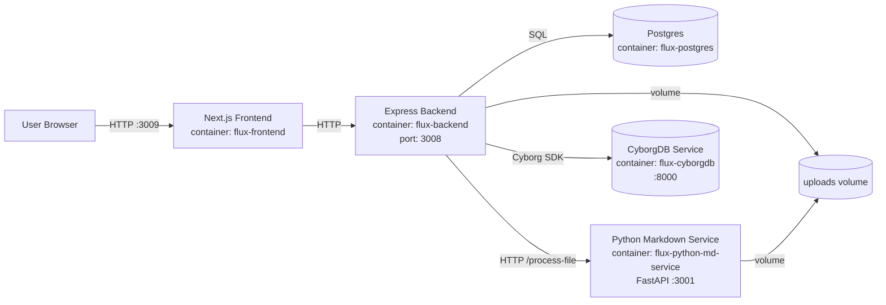
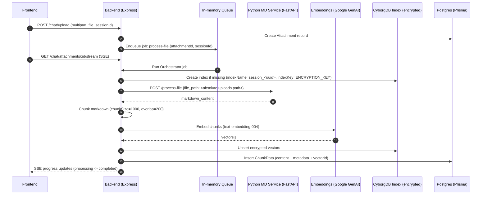
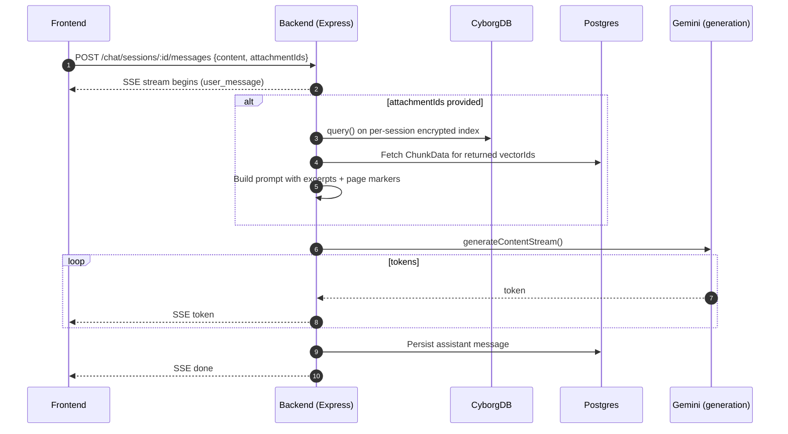
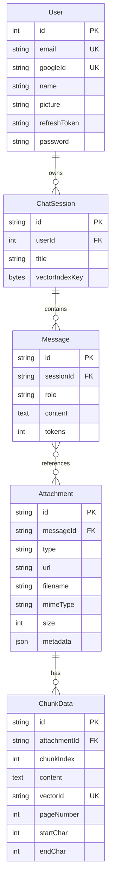

# Cyborg-DB (Flux AI)

Flux AI is a full-stack document Q&A application that performs Retrieval-Augmented Generation (RAG) over user-uploaded files, while storing vector embeddings inside an encrypted CyborgDB index.

This repository contains:
- A Next.js (App Router) frontend UI.
- A Node.js (Express + TypeScript) backend API.
- A Python FastAPI microservice that converts files/URLs into Markdown (used for ingestion).
- Postgres (Prisma) for users/sessions/messages/attachments and chunk metadata.
- CyborgDB service container for encrypted vector storage and similarity search.

## What's Implemented

**RAG pipeline (document ingestion)**
- Upload a file to a chat session.
- Backend queues an in-process job.
- Python microservice converts the file to Markdown.
- Backend chunks the Markdown and creates embeddings using Google GenAI embeddings.
- Embeddings are upserted into a per-session encrypted CyborgDB index.
- Chunk text + metadata (pageNumber, char offsets) are stored in Postgres.

**Chat with streaming responses**
- Messages are streamed to the client via Server-Sent Events (SSE).
- If you select attachments, the backend retrieves context using encrypted vector search (CyborgDB) and injects excerpts into the system prompt.

**Session & attachment UX**
- Session CRUD (create/list/get/delete).
- Attachment upload, processing status, and chunk viewer.
- Backend emits "engine events" (SSE) for logs/notifications.

**Auth**
- JWT-based auth with optional Google OAuth callback flow.
- Guest login flow (creates/uses a `guest@fluxai` user via seed + API).

## Current Features

- Encrypted vector search with CyborgDB: per-session index (`ivfflat`, 768-dim) using `ENCRYPTION_KEY`.
- Multi-format ingestion: PDFs, Office docs (DOCX/PPTX/XLSX), images, and common text formats (based on backend upload allow-list).
- Background document processing pipeline: markdown conversion (Python service) -> chunking -> embeddings (Google GenAI) -> CyborgDB upsert -> Postgres chunk metadata.
- Streaming chat: server streams assistant tokens over SSE and persists messages to Postgres.
- Attachment-scoped RAG: user selects attachments per message; retrieval uses encrypted vector search and injects excerpts into the prompt.
- Real-time UX telemetry: session "engine events" (SSE) plus per-attachment processing progress stream.
- Session management: create/list/get/delete chat sessions.
- Attachment management: upload, processing status, authorized file serving, and chunk viewer endpoint.
- Authentication flows: guest login and optional Google OAuth (credentials file required), with JWT refresh endpoint.

## Architecture

### Container Topology



### File Ingestion Flow (Indexing)



### Chat + Retrieval + Streaming



### Data Model (Prisma)



## Clone & Setup

### Prerequisites
- Docker Desktop (recommended for local setup).
- If running without Docker: Node.js 18+, Python 3.11+, and a Postgres instance.
- Google GenAI API key for embeddings and generation.

### 1) Clone

```bash
git clone https://github.com/arpan-lol/cyborg-db.git
cd cyborg-db
```

### 2) Configure environment

Create a `.env` at the repo root:

```bash
copy .env.example .env
```

Key variables used by the code:
- `DATABASE_URL` (Postgres connection string)
- `JWT_SECRET` (used by backend JWT middleware)
- `FRONTEND_ORIGIN` and `FRONTEND_REDIRECT`
- `REDIRECT_URI` (Google OAuth callback for backend)
- `GOOGLE_GENAI_API_KEY` (used by backend for embeddings + Gemini generation, and by the Python MD service optionally)
- `CYBORG_BASE_URL`, `CYBORGDB_API_KEY` (CyborgDB SDK config)
- `ENCRYPTION_KEY` (base64; used as the CyborgDB index key)
- `PYTHON_SERVICE_URL` (backend -> python service)
- `NEXT_PUBLIC_API_URL`, `NEXT_PUBLIC_FRONTEND_URL`, `API_URL_INTERNAL` (frontend)

**Important notes for Docker Compose on this repo (defaults in `.env.example` may need adjusting):**
- Frontend is exposed as `http://localhost:3009` (container port 3000).
- Backend is exposed as `http://localhost:3008`.
- A typical local Docker setup uses:
  - `FRONTEND_ORIGIN=http://localhost:3009`
  - `FRONTEND_REDIRECT=http://localhost:3009/auth/callback`
  - `NEXT_PUBLIC_API_URL=http://localhost:3008`
  - `NEXT_PUBLIC_FRONTEND_URL=http://localhost:3009`

**Generate an encryption key (PowerShell):**

```powershell
$bytes = New-Object byte[] 32
[Security.Cryptography.RandomNumberGenerator]::Create().GetBytes($bytes)
[Convert]::ToBase64String($bytes)
```

Paste the output into `ENCRYPTION_KEY`.

### 3) (Optional) Google OAuth credentials

The backend expects a Google OAuth client credentials JSON at:
- `backend/google-creds.json`

The OAuth client's redirect URI must match `REDIRECT_URI` (example: `http://localhost:3008/auth/google/callback`).

If you do not configure OAuth, the UI supports **guest login**.

### 4) Start the stack

```bash
docker compose up --build
```

Services (from the root compose):
- Frontend: `http://localhost:3009`
- Backend: `http://localhost:3008`
- CyborgDB service: internal network (base URL `http://cyborgdb:8000` from containers)
- Python MD service: internal network (FastAPI on `:3001`)
- Postgres: internal network

### 5) Run database migrations + seed

The backend image includes Prisma schema/migrations, but migrations are not automatically executed on container start.

Run these once after first startup:

```bash
docker compose exec backend npx prisma migrate deploy --schema=src/prisma/schema.prisma
docker compose exec backend npm run prisma:seed
```

The seed creates/updates a guest user (`guest@fluxai`).

## Deployment (VM)

This repo is easiest to deploy on a VM using Docker Compose (same layout as local).

### VM prerequisites

- A Linux VM (Ubuntu 22.04/24.04 is a common choice).
- Docker Engine + Docker Compose plugin installed.
- Open inbound access for the UI (recommended): TCP `80`/`443` (via reverse proxy) or TCP `3009` directly.

### 1) Install Docker (Ubuntu)

Follow Docker's official installation docs for your distro, then confirm:

```bash
docker --version
docker compose version
```

### 2) Clone and configure

```bash
git clone https://github.com/arpan-lol/cyborg-db.git
cd cyborg-db
cp .env.example .env
```

Edit `.env` for VM deployment. Common adjustments:

- `FRONTEND_ORIGIN=http://<your-vm-domain-or-ip>` (or `https://...` if using TLS)
- `FRONTEND_REDIRECT=http://<your-vm-domain-or-ip>/auth/callback`
- `NEXT_PUBLIC_FRONTEND_URL=http://<your-vm-domain-or-ip>`
- `NEXT_PUBLIC_API_URL=http://<your-vm-domain-or-ip>:3008` (or your proxied backend URL)
- Set `GOOGLE_GENAI_API_KEY` and `ENCRYPTION_KEY`

If you are reverse-proxying the frontend only (recommended), keep backend bound to the VM but not exposed publicly by firewall rules.

### 3) Start containers

```bash
docker compose up --build -d
docker compose ps
```

### 4) Apply migrations and seed

```bash
docker compose exec backend npx prisma migrate deploy --schema=src/prisma/schema.prisma
docker compose exec backend npm run prisma:seed
```

### 5) Reverse proxy (recommended)

Recommended setup:

- Public: `80/443` -> reverse proxy -> `frontend:3000` (host port `3009`)
- Private/internal: backend remains on `3008` (allow only from proxy or trusted IPs)

Example Nginx server block (host-side) proxying the UI:

```nginx
server {
  listen 80;
  server_name your-domain.example;

  location / {
    proxy_pass http://127.0.0.1:3009;
    proxy_set_header Host $host;
    proxy_set_header X-Forwarded-Proto $scheme;
    proxy_set_header X-Forwarded-For $proxy_add_x_forwarded_for;
  }
}
```

If you also proxy the backend, ensure CORS-related env vars align (`FRONTEND_ORIGIN`) and keep `/chat/.../events` and `/chat/.../stream` working (they use SSE).

### 6) Production notes (hygiene)

- Persisted data is stored in Docker volumes (`postgres_data`, `cyborgdb-data`, `uploads`). Back up volumes if needed.
- The ingestion job queue is in-memory; avoid restarting the backend during active processing.
- Monitor logs with `docker compose logs -f backend` and `docker compose logs -f md-service`.

## Local Development (No Docker)

If you prefer running services directly:

- Backend:
  ```bash
  cd backend
  npm install
  npm run dev
  ```
- Frontend:
  ```bash
  cd frontend
  npm install
  npm run dev
  ```
- Python MD service:
  ```bash
  cd backend/src/scripts
  pip install -r requirements.txt
  python api.py
  ```

You will also need:
- A running Postgres matching `DATABASE_URL`.
- A running CyborgDB service (the repo uses `cyborginc/cyborgdb-service:latest`).

## API Surface (Backend)

Base URL (local): `http://localhost:3008`

**Health**
- `GET /api/v1/healthcheck` -> `{ status: "ok" }`

**Auth**
- `GET /auth/google` -> redirects to Google OAuth consent screen
- `GET /auth/google/callback` -> exchanges code, upserts user, redirects to `FRONTEND_REDIRECT?jwt=...`
- `POST /auth/refresh` -> refreshes an expired JWT (requires stored Google refresh token)
- `POST /auth/logout` (JWT required)
- `GET /auth/me` (JWT required)
- `POST /auth/guest` -> returns a JWT for guest user

**Chat / Sessions / Attachments**
- `POST /chat/sessions` (JWT) -> create session
- `GET /chat/sessions` (JWT) -> list sessions
- `GET /chat/sessions/:id` (JWT) -> session details + messages
- `DELETE /chat/sessions/:id` (JWT) -> deletes session and attempts to delete CyborgDB index
- `GET /chat/sessions/:id/events` (JWT or `?token=`) -> SSE engine events
- `POST /chat/sessions/:id/messages` (JWT) -> SSE token stream response
- `POST /chat/upload` (JWT, multipart) -> upload attachment and start processing job
- `GET /chat/attachments/:attachmentId/status` (JWT)
- `GET /chat/attachments/:attachmentId/stream` (JWT or `?token=`) -> SSE processing progress
- `GET /chat/sessions/:sessionId/attachments/:attachmentId/chunks` (JWT) -> returns stored chunks (from Postgres)
- `GET /chat/uploads/:filename` (JWT) -> serves uploaded file if authorized

## Encrypted Vector Search (How It Works Here)

- A CyborgDB index is created per chat session:
  - index name: `session_<sessionId>` (UUID hyphens replaced with underscores)
  - index type: `ivfflat`, dimension `768`
- The encryption key (`indexKey`) is loaded from `ENCRYPTION_KEY` (base64) and used when creating/loading the index.
- Only vectors are stored in CyborgDB.
- Chunk text and metadata are stored in Postgres in `ChunkData`.

## Troubleshooting

- File upload errors:
  - Backend enforces 50MB max upload size via Multer.
  - Python service enforces 100MB max per file for `/process-file`.
- If vector operations fail, verify:
  - `ENCRYPTION_KEY` is set and base64-decodable.
  - `CYBORG_BASE_URL` points to the CyborgDB service (`http://cyborgdb:8000` in Docker).
- If the app starts but auth fails:
  - Ensure `JWT_SECRET` is set.
  - For Google OAuth, ensure `backend/google-creds.json` exists and `REDIRECT_URI` matches the Google Console configuration.

## Repository Structure

- `docker-compose.yml` -> full local stack
- `backend/` -> Express API, Prisma, CyborgDB integration
- `backend/src/scripts/` -> Python FastAPI markdown conversion service
- `frontend/` -> Next.js UI
